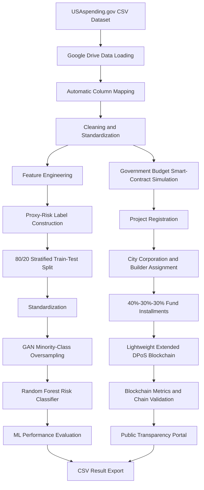

# Blockchain-Based Government Fund Management System

## Overview
This project aims to enhance transparency, security, and efficiency in government fund management using blockchain technology. By leveraging smart contracts and decentralized ledger technology, the system ensures accountable and tamper-proof transactions.

## Features
- **Secure & Transparent Transactions:** Ensures immutability and traceability of funds.
- **Smart Contract-Based Automation:** Reduces manual intervention and fraud.
- **Decentralized Fund Management:** Eliminates single points of failure.
- **Efficient Fund Allocation:** Enables real-time monitoring and audits.

## Tech Stack

### Backend Development
| Purpose                  | Component/Application | Specification                 |
|--------------------------|----------------------|------------------------------|
| Code Editing            | Visual Studio Code   | Version 1.86                 |
| Local Blockchain        | Ganache             | Version 7.9.2                 |
| Smart Contract Development | Solidity        | Version 0.8.24               |
| Deployment Framework     | Truffle             | Version 5.11.5               |
| Operating System        | Windows             | Version 10                    |
| CPU                     | Intel Core i5-10400 | 2.90 GHz - 4.30 GHz          |
| Memory                  | RAM                 | 16 GB                         |
| GPU                     | VRAM                | 6 GB                          |

### Frontend Development
| Purpose             | Component/Application | Specification                     |
|---------------------|----------------------|---------------------------------|
| Programming Language | JavaScript          | -                               |
| Operating System    | Windows             | Windows 10 (64-bit)            |
| Browser Support    | Google Chrome, Brave, Firefox | -                |
| Library/Frameworks | React JS, Bootstrap, Tailwind CSS, Web3.js, Ethers.js | - |

## Installation & Setup
### Prerequisites
Ensure the following are installed on your system:
- **Node.js** (Latest LTS version)
- **Ganache** (For local blockchain simulation)
- **Truffle** (For smart contract deployment)
- **Metamask** (Browser extension for Web3 transactions)
- **Visual Studio Code** (For coding)

### Steps
1. **Clone the Repository**
   ```sh
   git clone https://github.com/your-repository.git
   cd blockchain-fund-management
   ```
2. **Install Dependencies**
   ```sh
   npm install
   ```
3. **Run Ganache**
   - Open Ganache and start a new workspace.
4. **Compile & Deploy Smart Contracts**
   ```sh
   truffle compile
   truffle migrate --network development
   ```
5. **Start Frontend**
   ```sh
   npm start
   ```
6. **Connect Metamask**
   - Import the generated accounts from Ganache.
   - Set up a custom RPC using the Ganache network details.


## Risk Analysis and Lightweight Extended DPoS Simulation using USAspending.gov Dataset

This project presents a Google Colab–based research prototype for transparent, accountable, and data-driven government fund management. It combines USAspending.gov transaction data, machine learning, Generative Adversarial Network (GAN)–based class balancing, simulated smart-contract operations, and a lightweight Extended Delegated Proof-of-Stake (DPoS) blockchain.

The notebook processes federal award records, constructs a reproducible proxy-risk label, trains a Random Forest classifier to identify unusual fund transactions, simulates project-level budget allocation, and records fund transfers in a tamper-evident blockchain ledger.

> **Implementation note:** The current version is a Python simulation designed for Google Colab. It does not require Ganache, Truffle, Solidity, MetaMask, React, or a deployed Ethereum network.

---

## Key Features

- **USAspending.gov data integration:** Loads a government spending CSV file directly from Google Drive.
- **Automatic column mapping:** Detects suitable award, agency, recipient, location, date, budget, and transaction fields.
- **Government fund dataset construction:** Converts raw federal award data into a standardized project-level structure.
- **Risk-label generation:** Creates a reproducible proxy-risk label from unusual budget and transaction patterns.
- **GAN-based class balancing:** Generates synthetic minority-class records to reduce class imbalance.
- **Machine-learning risk detection:** Uses a Random Forest classifier to identify potentially unusual transactions.
- **Simulated smart contracts:** Implements project registration, authority assignment, builder assignment, installment release, and builder payment.
- **Lightweight Extended DPoS:** Elects active delegates using stake, reputation, and availability.
- **Tamper-evident ledger:** Uses SHA-256 hashes, previous-block references, transaction identifiers, and simulated signatures.
- **Transparency portal:** Produces project-level budget allocation and utilization summaries.
- **Performance analysis:** Reports transaction latency, throughput, block-generation time, validation time, gas usage, and chain validity.
- **Exportable research outputs:** Saves machine-learning, blockchain, delegate, transparency, and processed-dataset results as CSV files.

---

## System Workflow



---

## Notebook

The implementation is provided in:

```text
Updated- USAspending_GAN_Lightweight_Extended_DPoS.ipynb
```

The notebook is organized into 24 executable blocks covering package installation, dataset loading, preprocessing, GAN training, classification, blockchain simulation, metric calculation, visualization, and result export.

---

## Technology Stack

| Category | Technology |
|---|---|
| Execution Environment | Google Colab |
| Programming Language | Python 3 |
| Data Processing | pandas, NumPy |
| Machine Learning | scikit-learn |
| Generative Modeling | TensorFlow/Keras |
| Visualization | Matplotlib |
| Dataset Storage | Google Drive |
| Classification Model | Random Forest |
| Class-Balancing Method | Generative Adversarial Network |
| Blockchain Type | Lightweight Python blockchain simulation |
| Consensus | Extended Delegated Proof-of-Stake |
| Cryptographic Hash | SHA-256 |
| Output Format | CSV |

### Required Python Packages

```python
pandas
numpy
scikit-learn
tensorflow
matplotlib
```

The notebook installs these packages automatically in its first code block.

---

## Dataset

The notebook is designed for a CSV export obtained from **USAspending.gov**.

### Default Google Drive Location

```text
/content/drive/MyDrive/p-83/GDataset/GFunddata.csv
```

The expected Google Drive folder structure is:

```text
My Drive/
└── p-83/
    └── GDataset/
        └── GFunddata.csv
```

To use a different file location, update the following variable in Block 3:

```python
DATASET_PATH = "/content/drive/MyDrive/p-83/GDataset/GFunddata.csv"
```

### Automatic Field Mapping

The notebook searches for suitable USAspending columns corresponding to:

- Project or award identifier
- Project or award description
- Funding or awarding agency
- Treasury or federal account
- Recipient city, county, or state
- Recipient or contractor
- Total budget or obligated amount
- Transaction amount
- Award or action date
- Award type
- Project location

If several candidate columns exist, the first matching field in the configured candidate list is selected.

### Standardized Dataset Fields

The processed government fund dataset contains:

| Field | Description |
|---|---|
| `Project_ID` | Unique project or award identifier |
| `Project_Name` | Award or project description |
| `Finance_Ministry` | Funding or awarding agency |
| `Treasury` | Treasury or federal funding account |
| `City_Corporation` | Recipient or performance location authority |
| `Builder` | Recipient, contractor, or implementing organization |
| `Budget` | Total project budget |
| `Transaction_Amount` | Federal transaction or obligation amount |
| `Award_Type` | Award category |
| `Project_Location` | Project or recipient location |
| `Action_Date` | Award action date |
| `Risk_Label` | Generated proxy-risk class |

---

## Data Preprocessing

The notebook performs the following operations:

1. Converts budget and transaction fields to numeric values.
2. Replaces infinite values with missing values.
3. Fills missing amounts using available budget information.
4. Converts negative financial reversals to absolute values for simulation.
5. Removes zero-budget records.
6. Fills missing categorical values with `"Unknown"`.
7. Generates missing project identifiers.
8. Removes duplicate project-transaction records.
9. Parses action dates into year, month, and day.
10. Label-encodes categorical machine-learning features.
11. Standardizes numerical features using `StandardScaler`.

---

## Feature Engineering

The model uses categorical, financial, temporal, and text-length features.

### Financial Features

- Log-transformed budget
- Log-transformed transaction amount
- Transaction-to-budget ratio

### Temporal Features

- Action year
- Action month
- Action day

### Organizational and Project Features

- Project name
- Funding agency
- Treasury account
- City or local authority
- Builder or recipient
- Award type
- Project location

### Text-Length Features

- Recipient-name length
- Project-name length

---

## Proxy-Risk Label

USAspending.gov does not provide a verified fraud label. Therefore, the notebook constructs a reproducible **proxy-risk label** for experimental analysis.

A transaction is labeled as higher risk when at least one of the following conditions is satisfied:

- Budget is at or above the 97th percentile.
- Transaction amount is at or above the 97th percentile.
- Transaction-to-budget ratio is at or below the 1st percentile.
- Transaction-to-budget ratio is at or above the 99th percentile.

```python
Risk_Label = 1  # Unusual or higher-risk pattern
Risk_Label = 0  # Regular pattern
```

> The generated label represents statistical irregularity, not confirmed fraud, corruption, misuse, or legal wrongdoing.

---

## Machine-Learning Pipeline

### Data Split

- Training set: 80%
- Testing set: 20%
- Split type: Stratified
- Random seed: `42`
- Cross-validation: Not used in the current notebook

### GAN-Based Oversampling

A feed-forward GAN is trained using minority-class training records.

| Parameter | Value |
|---|---:|
| Latent dimension | 32 |
| Training epochs | 200 |
| Batch size | 64 |
| Generator hidden layers | 64, 128 |
| Discriminator hidden layers | 128, 64 |
| Optimizer | Adam |
| Learning rate | 0.0002 |
| Adam `beta_1` | 0.5 |

The generated feature values are clipped to the observed minimum and maximum values of the original minority class before being added to the balanced training set.

### Random Forest Classifier

| Parameter | Value |
|---|---:|
| Number of trees | 200 |
| Maximum depth | 15 |
| Minimum samples to split | 4 |
| Minimum samples per leaf | 2 |
| Class weighting | Balanced |
| Random seed | 42 |
| Parallel processing | Enabled |

### Evaluation Metrics

- Accuracy
- Precision
- Recall
- F1-score
- ROC-AUC
- Training time
- Prediction time
- Classification report
- Confusion matrix

---

## Lightweight Blockchain Architecture

The notebook implements a memory-efficient Python blockchain containing:

- Genesis block
- Pending transaction pool
- Configurable transaction capacity per block
- SHA-256 block hashing
- Previous-block hash linking
- Transaction identifiers
- Simulated digital signatures
- Gas accounting
- Block producer identity
- Chain-integrity validation

### Default Blockchain Configuration

| Parameter | Value |
|---|---:|
| Maximum sampled projects | 1,000 |
| Transactions per block | 20 |
| Delegate candidates | 7 |
| Active delegates | 5 |
| Maximum installments per project | 3 |
| Proof type | Extended Delegated Proof-of-Stake |

The number of sampled projects can be changed in Block 17:

```python
BLOCKCHAIN_SAMPLE_SIZE = min(1000, len(data))
```

---

## Extended Delegated Proof-of-Stake

Each delegate is initialized with a simulated:

- Stake score
- Reputation score
- Availability score

The delegate voting score is calculated as:

```text
Voting Score =
    0.50 × Stake
  + 0.30 × Reputation
  + 0.20 × Availability
```

The highest-ranked delegates become active block producers. Blocks are generated through a reputation-aware weighted round-robin rotation among active delegates.

The delegate report contains:

- Delegate identifier
- Stake
- Reputation
- Availability
- Voting score
- Blocks produced
- Active-delegate status

---

## Simulated Government Budget Smart Contracts

The `GovernmentBudgetSmartContract` class represents three logical components:

1. **Project Registry**
2. **Fund Transfer Manager**
3. **Transparency Portal**

### Smart-Contract Operations

| Function | Purpose | Simulated Gas |
|---|---|---:|
| `createProject` | Registers a government project and its budget | 270,781 |
| `assignCityCorporation` | Assigns the responsible local authority | 57,606 |
| `assignBuilder` | Assigns the contractor or implementing organization | 57,631 |
| `sendInstallment` | Transfers an installment from the treasury to the local authority | 102,041 |
| `sendFundsToBuilder` | Transfers available funds from the local authority to the builder | 74,221 |

### Fund-Release Schedule

Each project budget is released in three installments:

```text
First installment:  40%
Second installment: 30%
Third installment:  30%
```

For every successful installment, the same amount is transferred from the city corporation to the assigned builder.

---

## Public Transparency Portal

The simulated transparency portal reports:

| Field | Description |
|---|---|
| `Project_ID` | Project identifier |
| `Allocated_Budget` | Total approved budget |
| `Sent_to_City` | Funds transferred to the local authority |
| `Sent_to_Builder` | Funds transferred to the builder |
| `Pending_at_City` | Funds held by the local authority |
| `Unreleased_Budget` | Budget not yet released |
| `Installment_Count` | Number of completed installments |
| `Utilization_Rate_Percent` | Percentage of allocated budget transferred to the builder |

---

## Blockchain Performance Metrics

The notebook calculates:

- Proof type
- Projects processed
- Total confirmed transactions
- Total non-genesis blocks
- Average transaction-submission latency
- Transaction throughput in transactions per second
- Average block-generation time
- Total block-generation time
- Chain-validation time
- Average simulated gas used
- Total simulated gas used
- Chain-validity status

It also visualizes:

- Block-generation time by block number
- Gas consumption by block number
- GAN discriminator and generator losses

---

## Running the Project in Google Colab

### 1. Prepare the Dataset

Place the USAspending CSV file at:

```text
My Drive/p-83/GDataset/GFunddata.csv
```

Alternatively, update `DATASET_PATH` in Block 3.

### 2. Open the Notebook

Upload the `.ipynb` file to Google Drive and open it with Google Colab, or upload it directly through the Colab interface.

### 3. Select a Runtime

From the Colab menu:

```text
Runtime → Change runtime type
```

A CPU runtime is sufficient. A GPU runtime can accelerate TensorFlow GAN training.

### 4. Run the Notebook

Select:

```text
Runtime → Run all
```

### 5. Authorize Google Drive

When prompted, authorize Colab to mount your Google Drive.

### 6. Review and Download Results

The final notebook blocks display the combined results, save all output files, and trigger browser downloads.

---

## Generated Output Files

| File | Description |
|---|---|
| `ML_Results_GAN_USAspending_NoCV.csv` | Machine-learning evaluation metrics |
| `Lightweight_DPoS_Blockchain_Metrics.csv` | Blockchain performance and validity metrics |
| `Extended_DPoS_Delegate_Results.csv` | Delegate ranking and block-production summary |
| `Public_Transparency_Portal_Results.csv` | Project-level allocation and utilization records |
| `Processed_USAspending_Blockchain_Dataset.csv` | Cleaned and standardized research dataset |

---

## Reproducibility

The project uses the following random seed:

```python
SEED = 42
```

The seed is applied to:

- Python random operations
- NumPy
- TensorFlow
- Train-test splitting
- Random Forest training
- Delegate initialization
- Dataset sampling

Minor numerical differences may still occur across TensorFlow versions, Colab hardware, and runtime configurations.

---

## Usage
- Government officials can allocate and monitor fund distribution.
- Auditors can verify fund usage transparently.
- Citizens can view fund allocation records for accountability.

---


## Research Limitations

- The blockchain and smart contracts are Python simulations rather than deployed Ethereum contracts.
- Gas values are predefined experimental estimates and do not represent live network fees.
- Digital signatures are simulated using deterministic hashes rather than asymmetric cryptography.
- Delegate stake, reputation, and availability values are synthetically generated.
- The model should not be used to accuse individuals or organizations of misconduct without independent auditing and verified evidence.

---

## Future Enhancements

- Implement Solidity smart contracts for project registration and fund transfer.
- Deploy contracts using an Ethereum-compatible test network.
- Add multi-signature approval for high-value transactions.
- Store supporting documents using IPFS or another distributed storage system.
- Integrate explainable AI methods such as SHAP and LIME.
- Add temporal anomaly detection and graph-based transaction analysis.
- Evaluate privacy-preserving or permissioned blockchain deployment.
- Test consensus behavior under malicious, unavailable, or low-reputation delegates.

---


